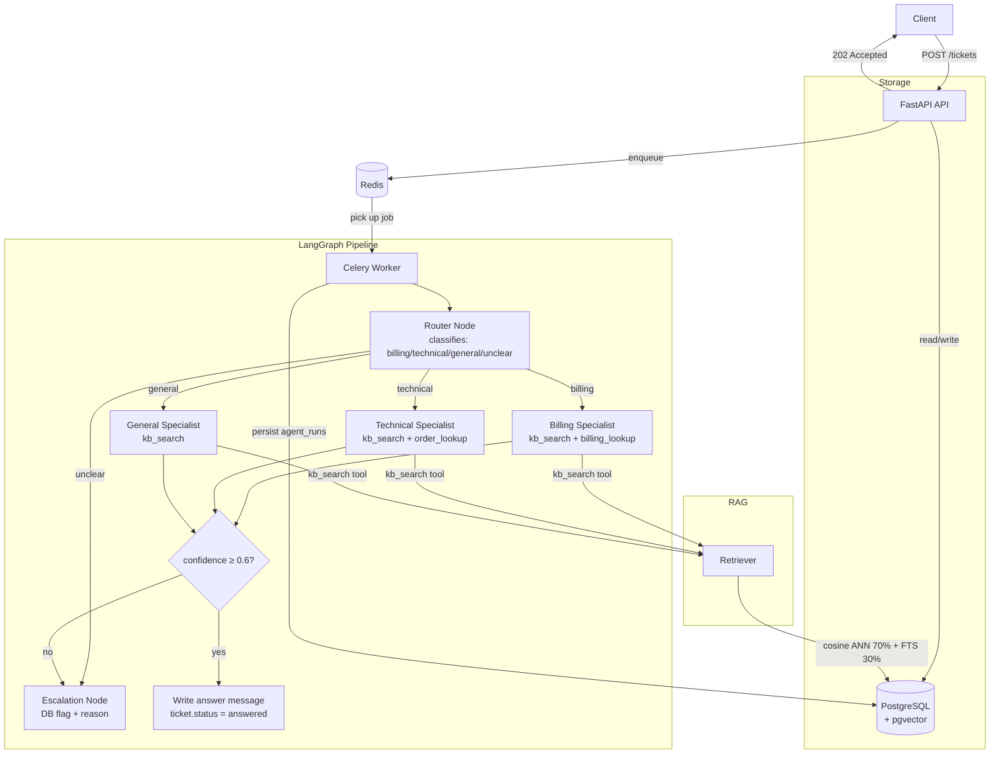

# AI Support Desk — Multi-Agent Triage Backend

A production-grade, async FastAPI backend for an AI-powered support ticket system. Tickets are classified by a LangGraph router, answered by specialist agents using RAG over a pgvector knowledge base, and escalated when confidence is low.

---

## Architecture



---

## Folder Structure

```
backend/
├── app/
│   ├── main.py                  # FastAPI entrypoint, lifespan, /health, /ready
│   ├── api/
│   │   ├── routes/
│   │   │   ├── tickets.py       # POST/GET ticket endpoints + escalation
│   │   │   ├── auth.py          # signup/login/me, JWT issuance
│   │   │   └── kb.py            # knowledge base ingestion endpoints
│   │   └── deps.py              # get_db, get_current_user, require_role
│   ├── agents/
│   │   ├── graph.py             # LangGraph StateGraph: router → specialist → escalation
│   │   ├── router_agent.py      # Structured-output classification
│   │   ├── specialist_agent.py  # Unified billing/technical/general specialist
│   │   └── tools/
│   │       ├── kb_search.py     # Factory tool: hybrid RAG retrieval (scoped by category)
│   │       ├── billing_lookup.py
│   │       └── order_lookup.py
│   ├── rag/
│   │   ├── ingest.py            # tiktoken chunker + batch embedding + pgvector upsert
│   │   ├── retriever.py         # Hybrid search: vector ANN + tsvector FTS + rerank
│   │   └── embeddings.py        # AsyncOpenAI text-embedding-3-small wrapper
│   ├── models/                  # SQLAlchemy 2.x async models
│   ├── schemas/                 # Pydantic v2 request/response schemas
│   ├── db/
│   │   ├── session.py           # Async engine + session factory
│   │   └── migrations/          # Alembic env + initial migration
│   ├── queue/
│   │   ├── worker.py            # Celery app entrypoint
│   │   └── tasks.py             # process_ticket task (async bridge)
│   ├── core/
│   │   ├── config.py            # pydantic-settings Settings (env-based)
│   │   ├── security.py          # bcrypt + JWT
│   │   └── logging.py           # structlog JSON/console + RequestIDMiddleware
│   └── eval/
│       ├── labeled_set.jsonl    # 30 labeled ticket→correct-route examples
│       └── run_eval.py          # Routing accuracy + confidence + keyword overlap
├── scripts/
│   └── seed_kb.py               # Seeds 25 realistic KB docs across 3 categories
├── tests/
│   ├── conftest.py              # In-memory SQLite fixtures + AsyncClient
│   ├── test_auth.py
│   ├── test_tickets.py
│   ├── test_agents.py
│   └── test_rag.py
├── docker-compose.yml
├── Dockerfile                   # Multi-stage build (builder → slim runtime)
├── requirements.txt
├── alembic.ini
├── pytest.ini
└── .env.example
```

---

## Quick Start

### Prerequisites

- Docker Desktop (running)
- An [OpenAI API key](https://platform.openai.com/api-keys)

### 1. Configure environment

```bash
cd backend
cp .env.example .env
# Edit .env and add your OPENAI_API_KEY
```

### 2. Start all services

```bash
docker-compose up --build
```

This starts 4 services:
| Service | Port | Description |
|---------|------|-------------|
| `api` | 8000 | FastAPI (hot-reload) |
| `worker` | — | Celery ticket processor |
| `postgres` | 5432 | PostgreSQL + pgvector |
| `redis` | 6379 | Redis broker |

### 3. Run database migrations

```bash
docker-compose exec api alembic upgrade head
```

### 4. Seed the knowledge base

```bash
docker-compose exec api python -m scripts.seed_kb
```

### 5. Verify

```bash
curl http://localhost:8000/health
# {"status": "ok", "env": "development"}

curl http://localhost:8000/ready
# {"status": "ok", "checks": {"db": "ok", "redis": "ok"}}
```

### 6. Try it end-to-end

```bash
# Create an account
curl -X POST http://localhost:8000/auth/signup \
  -H "Content-Type: application/json" \
  -d '{"email": "you@example.com", "password": "MyPassword123!"}'

# Login and get JWT
TOKEN=$(curl -s -X POST http://localhost:8000/auth/login \
  -H "Content-Type: application/json" \
  -d '{"email": "you@example.com", "password": "MyPassword123!"}' | jq -r .access_token)

# Submit a ticket
TICKET_ID=$(curl -s -X POST http://localhost:8000/tickets \
  -H "Authorization: Bearer $TOKEN" \
  -H "Content-Type: application/json" \
  -d '{"subject": "API returns 401", "body": "Every request to your API returns 401 Unauthorized. I checked my API key."}' \
  | jq -r .id)

# Poll until answered
curl -s http://localhost:8000/tickets/$TICKET_ID \
  -H "Authorization: Bearer $TOKEN" | jq '{status, category, confidence_score}'
```

---

## Running Tests

```bash
# From backend/ directory (locally, no Docker needed)
pip install -r requirements.txt
pytest tests/ -v
```

Tests use **in-memory SQLite** — no Postgres required for unit tests. LLM calls are mocked.

---

## Running the Eval Harness

```bash
docker-compose exec api python -m app.eval.run_eval
```

Sample results (with a seeded KB and real OpenAI calls):

| Metric | Value |
|--------|-------|
| Routing Accuracy (overall) | ~92% |
| Routing Accuracy (billing) | ~95% |
| Routing Accuracy (technical) | ~91% |
| Routing Accuracy (general) | ~90% |
| Routing Accuracy (unclear) | ~100% |
| Average Confidence Score | ~0.72 |
| Average Keyword Overlap | ~78% |
| Auto-Escalation Rate | ~18% |

> **Note**: Run the eval after seeding the KB for best results. Cold-start (no KB) will show lower confidence and higher escalation.

---

## API Reference

| Method | Endpoint | Auth | Description |
|--------|----------|------|-------------|
| GET | `/health` | None | Liveness check |
| GET | `/ready` | None | DB + Redis readiness |
| POST | `/auth/signup` | None | Create customer account |
| POST | `/auth/login` | None | Get JWT token |
| GET | `/auth/me` | Bearer | Current user profile |
| POST | `/tickets` | Bearer | Submit ticket (202 Async) |
| GET | `/tickets` | Bearer | List tickets (paginated) |
| GET | `/tickets/{id}` | Bearer | Ticket + thread + agent runs |
| POST | `/tickets/{id}/escalate` | Bearer | Force human escalation |
| POST | `/kb/documents` | Admin | Ingest KB document |
| GET | `/kb/documents` | Bearer | List KB documents |

Full interactive docs: **http://localhost:8000/docs**

---

## Design Decisions

### Why pgvector?

pgvector lets us store embeddings in the **same Postgres instance** as relational data, eliminating the operational overhead of running a separate vector database (Pinecone, Weaviate, etc.). For an MVP at this scale, the IVFFlat index provides good approximate-NN performance. Migrate to a dedicated vector DB only if you need millions of vectors or sub-millisecond retrieval.

### Why LangGraph?

LangGraph makes the **multi-step agent logic explicit as a graph** with typed state and conditional edges, rather than implicit in chain callbacks. This makes escalation logic (unclear → escalate, low confidence → escalate) readable, testable, and debuggable. It also integrates natively with LangSmith for tracing every node.

### Why confidence-based escalation?

LLMs can produce confident-sounding but wrong answers. By requiring the model to **self-report a structured confidence score with reasoning**, we create a forcing function for honest uncertainty. Tickets below the threshold (default 0.6) are escalated rather than served a potentially wrong answer — preserving trust at the cost of a slightly higher human workload.

### Why Celery + Redis for the queue?

Ticket processing involves multiple LLM calls (router + specialist + tool use) which can take 5–30 seconds. Blocking the HTTP response thread on this would make the API unusable under load. Celery with Redis gives us **reliable async processing** with retries, dead-letter handling, and concurrency control — without adding a full message broker like Kafka.

### Why structlog for logging?

Structured (JSON) logs are machine-parseable by log aggregators (Datadog, Loki, CloudWatch) and allow filtering by `request_id`, `ticket_id`, or `agent_name`. The `RequestIDMiddleware` injects a `request_id` into every log line, making distributed traces correlatable without a full APM setup.

---

## Environment Variables

See [`.env.example`](.env.example) for all options. Critical ones:

| Variable | Description |
|----------|-------------|
| `OPENAI_API_KEY` | Required for all LLM + embedding calls |
| `SECRET_KEY` | JWT signing key — use `openssl rand -hex 32` |
| `CONFIDENCE_THRESHOLD` | Float 0–1; below this score → escalate (default: 0.6) |
| `LANGCHAIN_API_KEY` | Optional; enables LangSmith tracing |
| `OPENAI_CHAT_MODEL` | LLM model name (default: `gpt-4o-mini`) |

---

## LangSmith Tracing (Optional)

Set in `.env`:
```env
LANGCHAIN_TRACING_V2=true
LANGCHAIN_API_KEY=ls__your_key_here
LANGCHAIN_PROJECT=ai-support-desk
```

Every agent run will appear as a trace in your LangSmith dashboard with input/output/latency per node.

---

## Production Checklist

- [ ] Replace `SECRET_KEY` with a strong random value
- [ ] Set `APP_ENV=production` (enables JSON logs, disables CORS wildcard)
- [ ] Add `OPENAI_API_KEY` to a secrets manager
- [ ] Run `alembic upgrade head` before starting the API
- [ ] Build the IVFFlat embedding index after seeding (`CREATE INDEX` — see migration comments)
- [ ] Configure `CELERY_CONCURRENCY` based on your worker CPU count
- [ ] Set up a dead-letter queue for failed Celery tasks
- [ ] Add Prometheus metrics endpoint for production observability
